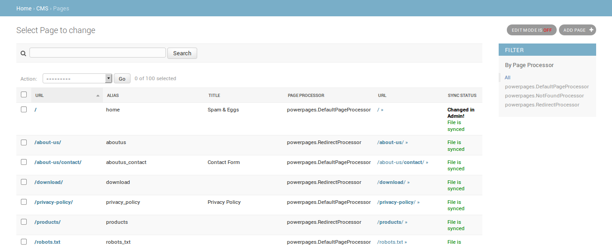
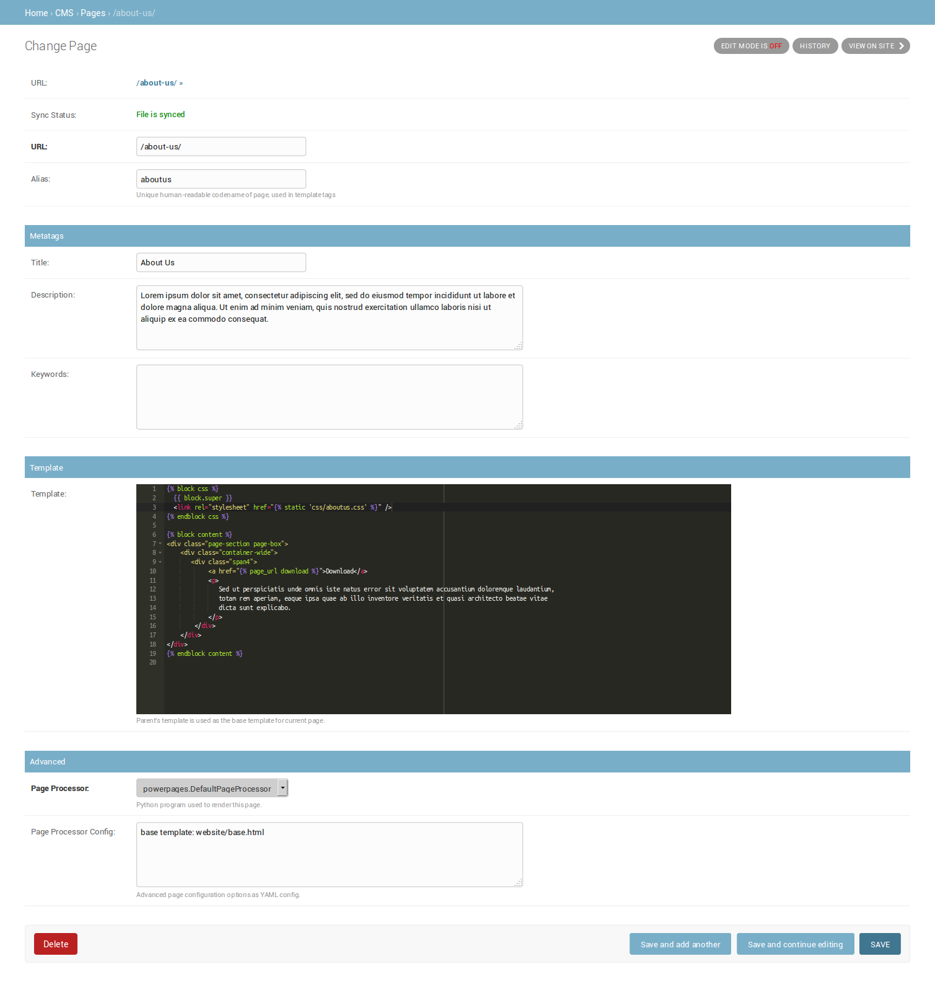

django-powerpages
=================

.. image:: https://api.travis-ci.org/Open-E-WEB/django-powerpages.svg?branch=master
   :target: https://travis-ci.org/Open-E-WEB/django-powerpages
.. image:: https://img.shields.io/pypi/v/django-powerpages.svg
   :target: https://pypi.python.org/pypi/django-powerpages
.. image:: https://coveralls.io/repos/github/Open-E-WEB/django-powerpages/badge.svg?branch=master
   :target: https://coveralls.io/github/Open-E-WEB/django-powerpages?branch=master

Developer-friendly, simple CMS for Django, "flatpages on steroids".

Features
--------

- edit pages in Admin using syntax highlighting - HTML, CSS, JavaScript, Django template language
- edit pages as files using your favourite text editor or IDE
- on demand synchronization of pages between database and file system using Django commands
- integration with Django's template system
- attach custom server-side logic to a page through configurable *Page Processors*
- sitemap.xml

Installation
------------

Install package using pip:

.. code-block:: python

   pip install django-powerpages
   

Add ``'powerpages'`` to ``INSTALLED_APPS`` in your settings module:

.. code-block:: python

   INSTALLED_APPS = (
       ...
       'powerpages',
   )

Define ``POWER_PAGES`` setting:

.. code-block:: python

   POWER_PAGES = {
       # absolute path to directory, where page files are located:
       'SYNC_DIRECTORY': '/path/to/directory/'
   }

Include app's URLs at the end of your urlconf:

.. code-block:: python

   urlpatterns = [
       ...
       url(r'', include('powerpages.urls', namespace='powerpages')),
   ]

Run migrations:

.. code-block:: python

   python manage.py migrate

Usage
-----

Admin screenshots:
~~~~~~~~~~~~~~~~~~

Synchronization
~~~~~~~~~~~~~~~

Export pages from database to file system is done by ``website_dump`` command.
All pages are saved as structure of files and directories inside ``settings.POWER_PAGES['SYNC_DIRECTORY']``.

.. code-block:: python

   python manage.py website_dump

Example structure of output directory:

.. code-block:: python

   _index_.page
   about-us/_index_.page
   about-us/contact.page
   download.page
   robots.txt

Each of dumped files has the following structure:

.. code-block:: python

   {
      ... page fields as JSON
   }
   ## TEMPLATE SOURCE: ##
   ... template content (plain text)

Import pages from directory into database is done using ``website_load`` command.

.. code-block:: python

   python manage.py website_load

Both website commands accept a variety of options to tweak their behaviour.
For the full list of options, use ``--help``.

**TODO: complete the documentation**

Requirements
------------

Python: 2.7

Django: 1.9